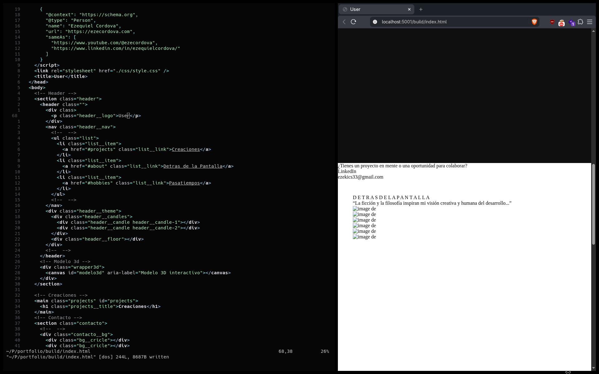

<div align="center">
  <h1>Arch Linux Minimal</h1>
  <p align="center">
        This is my workflow for develoment and hacking. <br>
        There’s more behind the code. Explore my ideas, experiments, and thoughts on the <a href="https://use-root.github.io/zeroot.github.io/"><b>BLOG</b></a>
  </p>
<ul>
</div>
</ul>

**This environment is designed to help users work quickly; if you want to add colors and lots of animations, go right ahead! :3**

### Environment

- bspwm & sxhkd
- alacritty & nvim
- obsidian & virt-manager (VM's)
- shell: bash

### Screenshots

|                                                                                   |                                                                                   |
| --------------------------------------------------------------------------------- | --------------------------------------------------------------------------------- |
|   |  |
|  |  |

#Instalar reflector y habilitar el pacman el paralelo a 15 ..

```bash
curl -LO http://z4root.github.io/dotfiles/RiceInstaller

# Give it execution permission
chmod +x arch-minimal

# Run the installer
./arch-minimal
```
