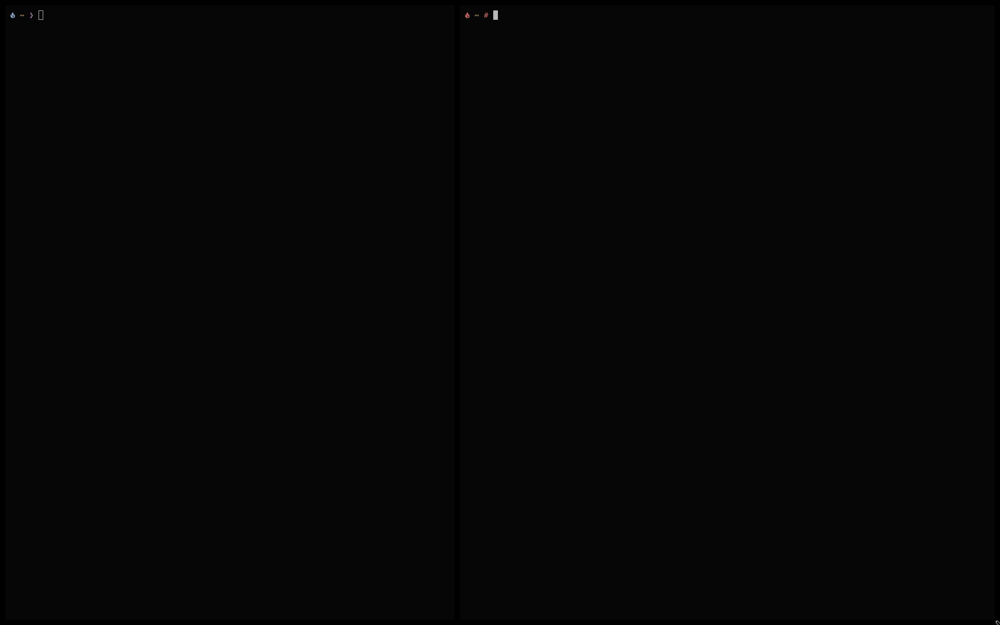
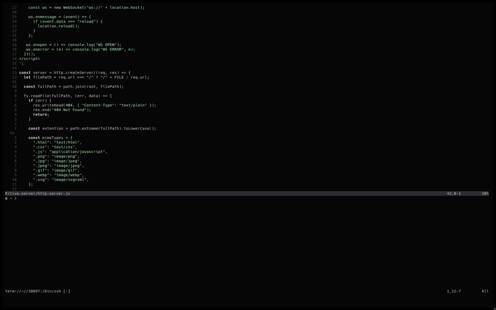
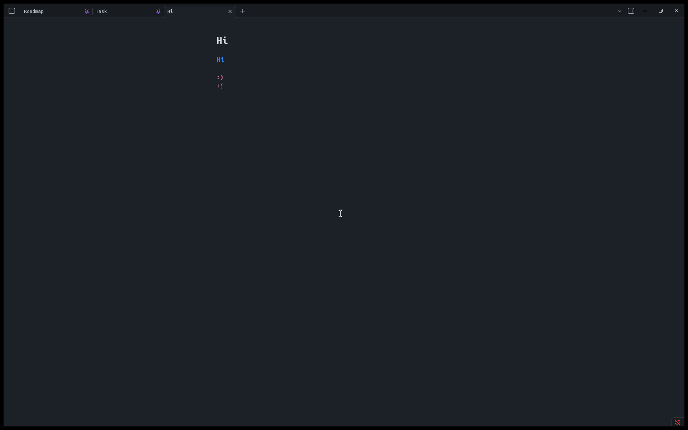

  <h1>Arch Linux Minimal</h1>
  

        This is my workflow for develoment and hacking. 
        If you'd like to see a technical explanation... please check out my <a href="https://use-root.github.io/zeroot.github.io/">Blog</a> — you'll find it helpful.
  

   
<ul>

</ul>

### My environment

- bspwm & sxhkd
- alacritty & nvim
- obsidian & virt-manager (VM's)
- shell: bash :3

### Screenshots

|                                                                             |                                                                             |
| --------------------------------------------------------------------------- | --------------------------------------------------------------------------- |
|   |  |
|  |  |
